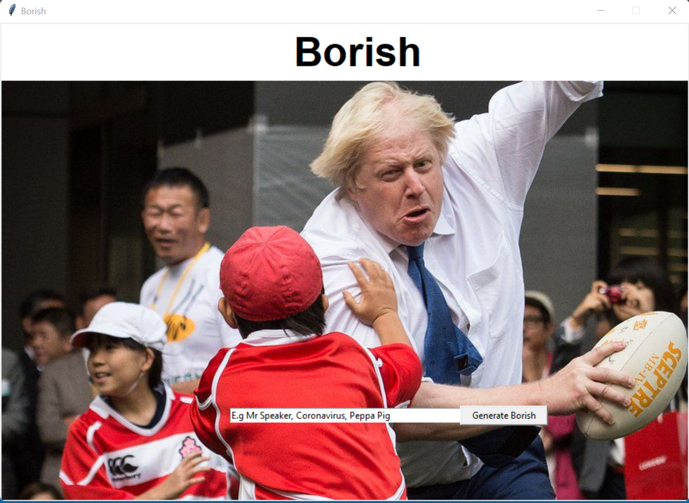

# Borish_App
 Submission For HackNotts  2021

 This is an app for spoofing the current UK prime minister, Boris Johnson, that attempts to predict his continuation given an input, the text is then displayed and read using text to speech.
 
 We scraped ~1,500,000 characters from the gov.uk website using the beautiful soup package and then fed this data into a recurrent neural network created using tensorflow in python. The RNN was adapted from --> https://www.tensorflow.org/text/tutorials/text_generation
 
 <-- These Files are only in this repository for show, once the RNN was trained and saved these were no longer needed -->
 beautifulsoup.ipynb <-- Web Scraping and string cleaning script  
 adaptedTextGen.ipynb <-- Tensorflow's RNN notebook adapted for our purposes  
 Boris.txt <-- Full lexicon of 1,500,000 characters of pure Bojo Charisma  
 
 We then saved this RNN and put it into a tkinter GUI which allows a user to enter in a prompt for our Boris bot to finish. The text is also then read out by a simple text to speech package.
 
  BorisGUI.py <-- Full functionality in one file  
  two_step <-- Saved Tensorflow model  
 
 
 
 With more time, a more realistic and bespoke TTS would be trained using Boris's real voice. The RNN would also be improved upon as it rarely produces coherent text.
 
 Installation and Running:
 
 Git clone https://github.com/Dolj0/Borish_App/
 pip install -r requirements.txt
 (Sometimes python might not recognise a few packages, should still be fine to run, if not pip install missing packages)
 python BorisGUI.py
 
 
 
 
 
